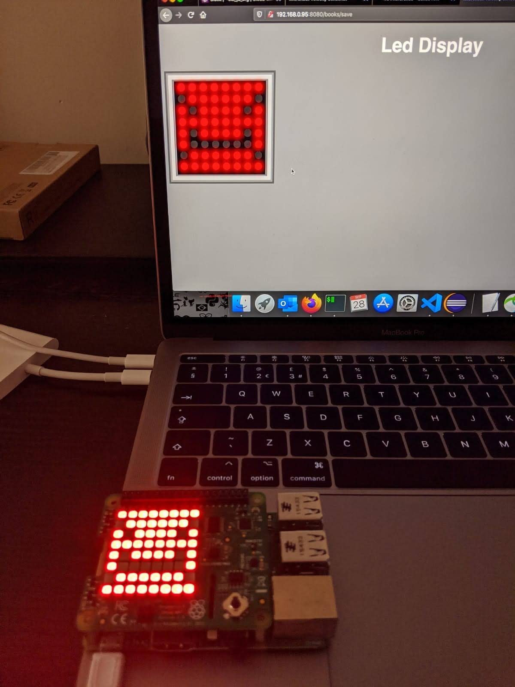

## Micronaut Velocity demo with Raspberry PI and Sense hat

This is an simple example of Micronaut Velocity interface that I use to control a 8x8 matrix led display using a Raspberry PI sense hat.

- [Blog post](http://www.igfasouza.com/blog/micronaut-velocity-with-raspberry-pi/)
